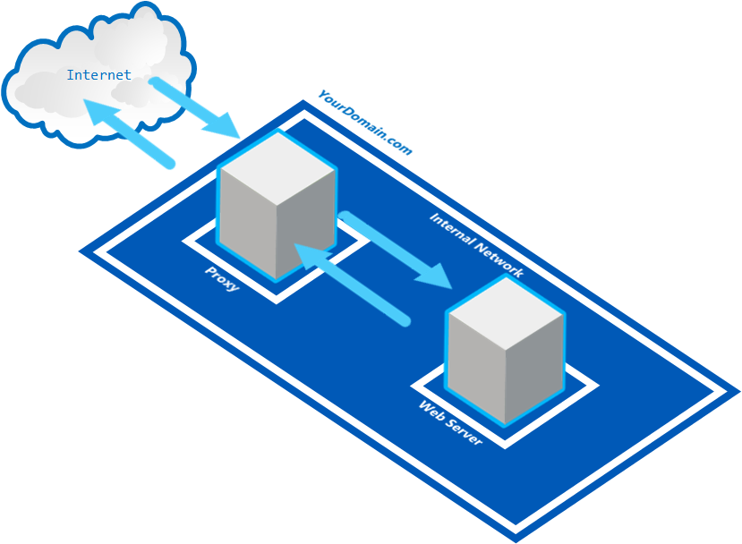
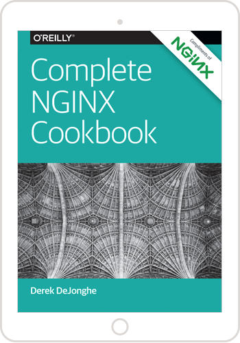

# An introduction to NGINX #
## NGINX: Web Server, Reverse Proxy, Load Balancer and HTTP Cache in one ##

In this article we'll show you some of the basic features of NGINX that allow you to accelerate content and application delivery, improve security, facilitate availability and scalability of web sites.

NGINX (pronounced as: Engine X) is currently in use by over 25% of the busiest sites in the world. These include Dropbox, Netflix, Wordpress, Yandex, VK, etc.

NGINX is also in use by all of the major cloud providers such as Microsoft Azure, Amazon AWS and Google Cloud Compute.

Configuring NGINX can be a daunting task, and is often not straightforward. However, in this lab we will focus on the bare minimum and provide you a few examples of very rudimentary use cases that will give you the confidence to start become more versed in NGINX configuration, as the first step is always the most important one.   

Although NGINX can be used on many different platforms, we will provide these examples in the context of Kuberbetes on Azure Container Services (AKS).

## Prerequisites

In order to run the samples in this lab, you will need the following:

- An active [Microsoft Azure](https://azure.microsoft.com/en-us/free "Microsoft Azure") Subscription
- [Azure CLI](https://docs.microsoft.com/en-us/cli/azure/overview?view=azure-cli-latest "Azure CLI") installed
- [Curl](https://curl.haxx.se/download.html "Curl") command line tool installed (for downloading ```kubectl``` as well as testing samples in this lab)
- [Kubernetes CLI (kubectl)](https://kubernetes.io/docs/tasks/tools/install-kubectl/ "Kubernetes CLI (kubectl)") installed
- A new **Resource Group** and **Container Service (AKS)** created in the [Microsoft Azure Portal](https://portal.azure.com "Microsoft Azure Portal") to run samples in.
- Open a Command Prompt window (with an active PATH environment variable pointing to Azure CLI and Kubernetes CLI)


### 1. How to configure NGINX

The configuration file structure of NGINX follows the rules in the NGINX documentation at [https://nginx.org/en/docs/beginners_guide.html#conf_structure](https://nginx.org/en/docs/beginners_guide.html#conf_structure "Configuration File’s Structure"):

NGINX consists of modules which are controlled by directives specified in the configuration file. Directives are divided into simple directives and block directives:
- A simple directive consists of the name and parameters separated by spaces and ends with a semicolon ;. 
- A block directive has the same structure as a simple directive, but instead of the semicolon it ends with a set of additional instructions surrounded by braces { and }. 

If a block directive can have other directives inside braces, it is called a context (examples: ```events```, ```http```, ```server```, and ```location```).

Directives placed in the configuration file outside of any contexts are considered to be in the main context. The ```events``` and ```http``` directives reside in the main context, ```server``` in ```http```, and ```location``` in ```server```.

The rest of a line after the # character is considered a comment.

A very rudimentary configuration file looks like this:

    http {
    	server {
			location / {
			}
		}
    }
    
Generally, the configuration file may include several server blocks distinguished by ports which they listen to and by server names. Once NGINX decides which server processes a request, it tests the URI specified in the request’s header against the parameters of the location directives defined inside the server block.

### 2. Serving static responses with NGINX

It is relatively easy to serve static responses straight from NGINX.

Consider the following example configuration file:

	http {
      server {

        listen 80;

        location / {
            return 200 'Eureka!';
        }
      }
    }
    
This implementation shows the text ```Eureka!``` when accessed through port 80. Mind the ```/``` that indicates the root of the web server. So, if our NGINX implementation was deployed as ```localhost```, browsing to ```http://localhost/``` would result in the following response: ```Eureka!```

### 3. Serving static files with NGINX
    
    http {
      server {
        listen 80;
    
        location / {
          root /data/www;
        }
      }
    }
    

This implementation hosts files from the ```/data/www``` folder as root of the web site ```http://localhost/```

#### 3.1 Serving static files for multiple locations with NGINX

    http {
      server {
        listen 80;
    
        location / {
          root /data/www;
        }

        location /images {
          root /data/images;
        }

      }
    }
    

This implementation would host files from the ```/data/www``` folder as root of the web site ```http://localhost/``` identical to the previous example.

However, a request to ```http://localhost/images``` will first be matched against ```/data/www/images``` to form the path on the local system where it will try to find the resource. But since there is also a match for ```http://localhost/images``` through the ```/images``` prefix, that one prevails over the shorter ```/``` prefix. 

> **Note:** Of all the matching ```location``` definitions, NGINX selects the one with the **longest** prefix.

So, in the above example ```http://localhost/images``` will return the resource located at ```/data/images```.

### 4. Serving an index file

    http {
      server {
        listen 80;
    
        location / {
          	index index.php index.htm index.html;
			root /data/www;
        }

      }
    }
    
This configuration allows our NGINX implementation ```http://localhost``` to be matched with an index file in ```/data/www```. The first match found is being served as an index file as response to the request of ```http://localhost```.  

### 5. Create a simple proxy with NGINX

A proxy server is a server that breaks the connection between sender and receiver. The proxy server will evaluate the incoming request, and if allowed, relays it to the outgoing side with the receiver.



    http {
      server {
        location / {
          proxy_pass http://someserver:8080/;
        }

        location ~ \.(gif|jpg|png)$ {
          root /data/images;
        }
	  }
    }

The configuration above serves all requests ending with ```.gif```, ```.jpg``` or ```.png``` from the ```/data/images``` folder and pass all other requests on to the proxied server ```someserver``` on port ```8080```. 

### 6. Create a load balancer with NGINX

    http {
      upstream backend {
        server  backend1.yourdomain.com  weight=5;
        server  backend2.yourdomain.com;
      }
      server {
        location / {
          proxy_pass http://backend/;
        }
	  }
    }

This configuration would route 83.33% (= 5/6) of the requests to the ```backend1``` server and the rest of the requests to ```backend2```.

### 7. Hands-on NGINX with Kubernetes and AKS

In this section we'll explain to you how you can run and test the above NGINX configuration samples in Kubernetes and Azure Container Services (AKS). 

#### 7.1. First time set up ##

If you never used Azure CLI or Kubernetes CLI before, or have used it but for a different subscription, you need to link your Azure subscription to the local Kubernetes configuration.

#### 7.1.1 **Kubernetes CLI Local Configuration**

If you are using the Kubernetes CLI on a windows machine, it expects a ```config``` file in this folder location:

````html
%USERPROFILE%\.kube
````

For instance, if your user name is TestUser, you may find the kubectl ```config``` file in ```C:\Users\TestUser\.kube```

**Optionally:** If your Kubernetes configuration file is located elsewhere, in order for the Kubernetes CLI (kubectl) to find your configuration, you need to add the above path (including the 'config' file name) to the ```KUBECONFIG``` environment variable in a Command Prompt window, as such:

    SET KUBECONFIG=c:\pathtokubeconfig\config

 
#### 7. 1.2 **Logging into Azure from the Command Line**

In order for the ```kubectl``` statements below to be fired against the correct Azure Kubernetes (AKS) instance, we need to link your Azure subscription to the local Kubernetes configuration.

First you need to sign in,  by entering the following command in a Command Prompt window:


    az login

This will result in the following output:

    To sign in, use a web browser to open the page https://aka.ms/devicelogin and enter the code B9R2CY8ZP to authenticate.
    
Next, open a browser and go to ```https://aka.ms/devicelogin``` and type in the code as returned from the ```az login``` command: ```B9R2CY8ZP```


This will authenticate your device against Azure and a response similar to this should appear in your Command Prompt window:

    [
      {
	    "cloudName": "AzureCloud",
	    "id": "3b7912c3-ad06-426e-8627-419123727111",
	    "isDefault": true,
	    "name": "CanvizDev",
	    "state": "Enabled",
	    "tenantId": "3dad2b09-9e66-4eb8-9bef-9f44544b0222",
	    "user": {
	      "name": "testuser@canviz.com",
	      "type": "user"
	    }
      }
    ]
    
#### 7.1.3 **Linking your Azure subscription**

Next, you need to link your Azure subscription so that the Azure CLI (```az```) will work against your environment.

    az account set --subscription "3b7912c3-ad06-426e-8627-419123727111" 

#### 7.1.4 **Getting Kubernetes configuration from Azure**

First, let's make a new resource group in "eastus" (the name of the region in Eastern U.S.), just for this example:

    az group create --name "TestKub" --location="eastus"

This will result in an output like this:

    {
     "id": "/subscriptions/3b7912c3-ad06-426e-8627-41912372774b/resourceGroups/TestKub",
     "location": "eastus",
     "managedBy": null,
     "name": "TestKub",
     "properties": {
       "provisioningState": "Succeeded"
     },
     "tags": null
    }

And also a small Kubernetes cluster to run our examples in:

	az aks create --name TestKub --resource-group TestKub --location "eastus" –-node-count 1 --generate-ssh-keys

> **Note:** This process may take a few minutes to complete.

Then, we can make sure we can use **Azure Container Service (AKS)** as our context for when we run ```kubectl``` commands, by entering the following command:

    az aks get-credentials --resource-group TestKub --name TestKub

where ```TestKub``` is the name of a **Resource Group** you have created before (or alternatively in the Azure Portal) and ```TestKub``` is the name of the **Managed Container Service** (AKS, not ACS!) you created in the Azure Portal. 

If successful, this will result in the following output:

    Merged "TestKub" as current context in C:\Users\TestUser\.kube\config


**Optionally: Set the context, if you have used other Kubernetes clusters before.**

If you have been developing against a local or a different Kubernetes cluster, your current ```kubectl``` configuration may point to a different cluster. To correct this, please use the following command:

    kubectl config set-context TestKub


#### 7.1.5 **Verify the correct Kubernetes cluster**

In order to verify that we are indeed talking to the correct Kubernetes cluster, we can use the following command:

    kubectl cluster-info

The output of this command should look similar to this:

    Kubernetes master is running at https://testkub-77a9ac84.hcp.eastus.azmk8s.io:443
    Heapster is running at https://testkub-77a9ac84.hcp.eastus.azmk8s.io:443/api/v1/namespaces/kube-system/services/heapster/proxy
    KubeDNS is running at https://testkub-77a9ac84.hcp.eastus.azmk8s.io:443/api/v1/namespaces/kube-system/services/kube-dns:dns/proxy
    kubernetes-dashboard is running at https://testkub-77a9ac84.hcp.eastus.azmk8s.io:443/api/v1/namespaces/kube-system/services/kubernetes-dashboard/proxy
    
If the URLs in the output point to localhost, please use the ```kubectl config set-context``` command to change the context to the correct cluster.

#### 7.1.6. Preparing an NGINX configuration file for use with Kubernetes

In order for Kubernetes to start an NGINX instance with your **customized** request splitting configuration (instead of the default configuration), there are a number of steps we need to perform:

1. We need to create a custom NGINX ```.conf``` configuration file.
2. We need to make the custom NGINX configuration file readable to a Kubernetes 
3.  by generating a ```ConfigMap``` object.
3. We need to reference the NGINX configuration from our Deployment configuration files (written in Yaml format).
3. We need to verify that the custom NGINX configuration file is successfully picked up by Kubernetes during deployment.

First, we will generate a custom NGINX configuration file that serves our need.

> **Note:** Unlike some of the examples on the web, ```ConfigMaps``` must be mounted as directories! Not as files. This is why the ```nginx-staticresponse.conf``` file has to be placed in a folder.
> 

> **Note:** Also, if you are more experienced with NGINX configuration files: NGINX configuration for Kubernetes cannot contain any top level configuration attributes such as ```http```, ```worker processes```, etc. You will need to strip those from your ```.conf``` file.

### 7.2. Serving a Static Response

In this section we'll guide you through the steps to:
- Create a ```ConfigMap``` object
- Create a Kubernetes 
-  and Deployment
- Expose a Kubernetes Deployment
- Test a Kubernetes Deployment

> **Note:** You will need to repeat these steps for each of the samples in this article. 

#### 7.2.1. Create ConfigMap object

Let's consider the configuration file ```nginx-staticresponse.conf```:

    server {

      listen 80;

      location / {
        return 200 'Eureka!';
      }
    }

> **Note:** Notice that we have stripped the top-level ```http { }``` block from our ```.conf``` file.

Now, let's run the command that will generate a ```ConfigMap``` for our custom NGINX ambassador configuration file:


    kubectl create configmap staticresponse-config --from-file=conf.d


> **Note:** Make sure you run this command from the working folder that contains the ```conf.d``` sub folder.

#### 7.2.2. Create Kubernetes Deployment

Next, we will reference the newly created ```ConfigMap``` in our Deployment yaml file:

    apiVersion: apps/v1beta1 # for versions before 1.9.0 use apps/v1beta2
    kind: Deployment
    metadata:
      name: staticresponse-deployment
    spec:
      selector:
        matchLabels:
          app: staticresponse
      replicas: 2 # tells deployment to run 2 pods matching the template
      template: # create pods using pod definition in this template
        metadata:
          # unlike pod-nginx.yaml, the name is not included in the meta data as a unique name is
          # generated from the deployment name
          labels:
            app: staticresponse
        spec:
          containers:
          - image: nginx
            name: staticresponse
            ports:
            - containerPort: 80
            volumeMounts:
            - name: config-volume
              mountPath: /etc/nginx/conf.d
          volumes:
          - name: config-volume
            configMap:
              name: staticresponse-config

> **Note:** It is extremely important when constructing Yaml files to follow the exact indentation from the samples for the configuration elements, as Yaml is extremely sensitive to that and your deployment may fail for unclear reasons because of wrong indentation.

> **Note:** Also, NO tabs can be used for indentation, only spaces. Make sure your code editor doesn't convert spaces into tabs or adds tabs when adding a carriage return. And also make sure when copy & pasting this code, the indentation isn't changed or replaced by tabs.

And then we will **deploy** the Kubernetes pods with the following statement:

    kubectl create -f staticresponse-deployment.yaml

#### 7.2.3. Expose the Kubernetes Deployment

Now the deployment is created, however we are not there yet. In order for us to access the deployment from the outside world, we need to **expose** the deployment by using this command:

    kubectl expose deployment staticresponse-deployment --port=80 --type=LoadBalancer

This will create two pods and an NGINX Load Balancer that will load balance requests between the two pods.

#### 7.2.4. Verify the Kubernetes deployment of the NGINX Static Reponse Web Server

In order to see if our pods and deployments actually exist and have succeeded, we'll use the following commands:

    kubectl get pods --output=wide

This will result in an output similar to this:

    NAME                                         READY STATUSRE  STARTS   AGE         IP             NODE
    staticresponse-deployment-2259644619-2573j   1/1   Running   0        <invalid>   10.244.0.119   aks-agentpool-25428128-1
    staticresponse-deployment-2259644619-tbbcx   1/1   Running   0        <invalid>   10.244.1.109   aks-agentpool-25428128-0
    
By executing the following command, we'll be notified when AKS has issued an IP address for our pod so we can test it from the outside world. 

    kubectl get services --watch

> 
> **Note:** the --watch flag will wait for the IP address to be populated and show the assigned IP address once available

Which results in an output similar to this:

    NAME                        TYPE           CLUSTER-IP    EXTERNAL-IP     PORT(S)        AGE
    staticresponse-deployment   LoadBalancer   10.0.237.65   <pending>       80:30698/TCP   1m
    kubernetes                  ClusterIP      10.0.0.1      <none>          443/TCP        5d

And once the IP address has become available:

    NAME                        TYPE           CLUSTER-IP    EXTERNAL-IP     PORT(S)        AGE
    staticresponse-deployment   LoadBalancer   10.0.237.65   13.90.241.40    80:30698/TCP   1m
    kubernetes                  ClusterIP      10.0.0.1      <none>          443/TCP        5d

Now, we can test our pod deployment by accessing the EXTERNAL-IP from a browser or a cURL statement:

    curl 13.90.241.40
    Eureka!
    
Eureka! Our first NGINX deployment in Kubernetes on AKS succeeded!

### 7.3. Serving Static Files


Consider the following NGINX configuration file ```nginx-staticfiles.conf```

      server {
        listen 80;
    
        location / {
          root /data/www;
        }
      }
    

If we create a ConfigMap object from this NGINX configuration file as explained before:

```kubectl create configmap staticfiles-config --from-file=conf.d```

And since a ConfigMap object in essence is just a collection of key value pairs, we can (ab)use the same mechanism to create a ConfigMap object of our /www folder (containing a sample index.html file), like this:

```kubectl create configmap staticfiles-www --from-file=www```

We can reference both ConfigMap objects as volumes while deploying our pods:

    apiVersion: apps/v1beta1 # for versions before 1.9.0 use apps/v1beta2
    kind: Deployment
    metadata:
      name: staticfiles-deployment
    spec:
      selector:
        matchLabels:
          app: staticfiles
      replicas: 2 # tells deployment to run 2 pods matching the template
      template: # create pods using pod definition in this template
        metadata:
          # unlike pod-nginx.yaml, the name is not included in the meta data as a unique name is
          # generated from the deployment name
          labels:
            app: staticfiles
        spec:
          containers:
          - image: nginx
            name: staticfiles
            ports:
            - containerPort: 80
            volumeMounts:
            - name: config-volume
              mountPath: /etc/nginx/conf.d
            - name: www-volume
              mountPath: /data/www
          volumes:
          - name: config-volume
            configMap:
              name: staticfiles-config
          - name: www-volume
            configMap:
              name: staticfiles-www


Now, let's create the deployment: 

```kubectl create -f staticfiles-deployment.yaml```

And expose the deployment to the outside world:

```kubectl expose deployment staticfiles-deployment --port=80 --type=LoadBalancer```

Then we can list our Kubernetes pods:

```kubectl get pods --output=wide```

And wait for the EXTERNAL-IP address to become available with:

```kubectl get services --watch```

After which we can browse to the external IP address:

    curl 52.234.148.187

Which should result in:

    <html>
    <body>
    Static Eureka!
    </body>
    </html>

### 7.4. Serving Multiple Static Files

In similar fashion we can serve multiple static files by expanding our ```location``` block, so we can also serve some images from our server:

Consider the following NGINX configuration file ```nginx-staticfilesmulti.conf```

    server {
      listen 80;
  
      location /images {
        # the location path is added to the root to make the full path
        root /data;
      }

      location / {
        root /data/www;
      }

    }
   
    

If we create a ConfigMap object from this NGINX configuration file as explained before:

```kubectl create configmap staticfilesmulti-config --from-file=conf.d```

And since a ConfigMap object in essence is just a collection of key value pairs, we can (ab)use the same mechanism to create a ConfigMap object of our /www folder (containing a sample index.html file), like this:

```kubectl create configmap staticfilesmulti-www --from-file=www```

As well as our /images folder:

```kubectl create configmap staticfilesmulti-images --from-file=images```

We can reference all three ConfigMap objects as volumes while deploying our Kubernetes pod:

    apiVersion: apps/v1beta1 # for versions before 1.9.0 use apps/v1beta2
    kind: Deployment
    metadata:
      name: staticfilesmulti-deployment
    spec:
      selector:
        matchLabels:
          app: staticfilesmulti
      replicas: 2 # tells deployment to run 2 pods matching the template
      template: # create pods using pod definition in this template
        metadata:
          # unlike pod-nginx.yaml, the name is not included in the meta data as a unique name is
          # generated from the deployment name
          labels:
            app: staticfilesmulti
        spec:
          containers:
          - image: nginx
            name: staticfilesmulti
            ports:
            - containerPort: 80
            volumeMounts:
            - name: config-volume
              mountPath: /etc/nginx/conf.d
            - name: www-volume
              mountPath: /data/www
            - name: images-volume
              mountPath: /data/images
          volumes:
          - name: config-volume
            configMap:
              name: staticfilesmulti-config
          - name: www-volume
            configMap:
              name: staticfilesmulti-www
          - name: images-volume
            configMap:
              name: staticfilesmulti-images

Now, let's create the deployment: 

```kubectl create -f staticfilesmulti-deployment.yaml```

And expose the deployment to the outside world:

```kubectl expose deployment staticfilesmulti-deployment --port=80 --type=LoadBalancer```

Then we can list our Kubernetes pods:

```kubectl get pods --output=wide```

And wait for the EXTERNAL-IP address to become available with:

```kubectl get services --watch```

After which we can browse to the external IP address:

    curl 52.234.148.187

Which should result in:

    <html>
    <body>
    Static Eureka!
    </body>
    </html>

And 

    curl http://52.234.148.187/images/index.html  

Which results in:

    IMAGES FOLDER!

Or, if we want to get the Canviz.png binary:

    curl http://52.234.148.187/images/Canviz.png --output -

Which will result in a messy terminal output and most likely a bunch of beeps.

### 8. Debugging NGINX

#### 8.1 NGINX log files

In case NGINX does not work as expected, you may try to find out the reason in ```access.log``` and ```error.log files``` in the directory ```/usr/local/nginx/logs``` or ```/var/log/nginx```.

#### 8.2. Accessing the NGINX log files from within the pod

kubectl run curl-staticfilesmulti-deployment --image=radial/busyboxplus:curl -i --tty --rm

### 9. Conclusion

Although not straightforward, we showed that firing up a simple web server in NGINX isn't rocket science either. By also showing how to do this inside a Kubernetes cluster in AKS we hope we have given you an idea of the diversity of platforms that use NGINX out there. Having basic NGINX knowledge can really be beneficial to you if you ever are tasked with setting up a load balancing web server in the cloud, whether it be AWS, Azure, Google or any other platform, chances are you may come in contact with NGINX at one point.    

### 10. More Information

To learn all about NGINX, we encourage you to read the book *NGINX Cookbook* by Derek DeJonghe: [https://www.nginx.com/resources/library/complete-nginx-cookbook/](https://www.nginx.com/resources/library/complete-nginx-cookbook/ "NGINX Cookbook")



## 11. Contributors ##
| Roles                                    			| Author(s)                                			|
| -------------------------------------------------	| ------------------------------------------------- |
| Author		                                    | Manfred Wittenbols (Canviz) @mwittenbols          |
| Editor                                            | Todd Baginski (Canviz) @tbag                      |

## 12. Version history ##

| Version | Date          		| Comments        |
| ------- | ------------------- | --------------- |
| 1.0     | Feb 1st, 2018 	    | Initial release |
| 1.1     | Apr 30th, 2018 	    | Final review |

## Disclaimer ##
**THIS CODE IS PROVIDED *AS IS* WITHOUT WARRANTY OF ANY KIND, EITHER EXPRESS OR IMPLIED, INCLUDING ANY IMPLIED WARRANTIES OF FITNESS FOR A PARTICULAR PURPOSE, MERCHANTABILITY, OR NON-INFRINGEMENT.**

----------


**Canviz Consultancy** 
 


